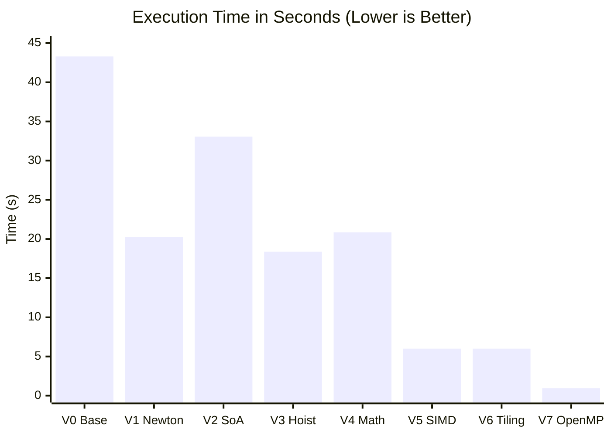
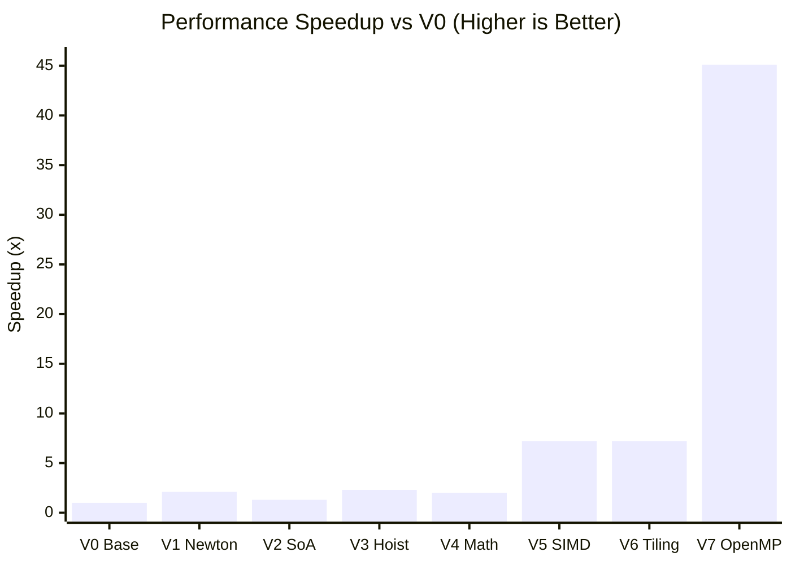

# Direct N-Body Simulation: An Optimization Journey

This project explores C++ optimization techniques (High Performance Computing) applied to the classic Direct N-Body simulation problem. The goal is not physical accuracy, but rather measuring and drastically reducing the computation time of a compute-intensive algorithm by fully exploiting CPU architecture (Cache, SIMD, Branch Predictor).

---

## 📑 Table of Contents
- [📊 Results and Benchmarks](#-results-and-benchmarks-n--100000)
- [1. Problem Description](#1-problem-description)
- [2. Mathematical Computation](#2-mathematical-computation)
- [3. Why the Naive Version is "Intractable"](#3-why-the-naive-version-is-intractable)
- [4. Optimization Roadmap](#4-optimization-roadmap)
- [5. Optimization History: From Naive to HPC](#5-optimization-history-from-naive-to-hpc)
- [6. How to Build and Run](#6-how-to-build-and-run)

---

## 📊 Results and Benchmarks (N = 100,000)

All tests were strictly executed in `Release` mode (`-O3 -march=native -ffast-math` flags).

| Version | Optimization Applied | Time (s) | Speedup vs V0 | Notes |
| :--- | :--- | :--- | :--- | :--- |
| **V0** | Baseline (Naive $O(N^2)$ Algorithm) | 43.30 s | **1.0x** | No optimization, AoS memory layout. |
| **V1** | Newton's Third Law | 20.25 s | **2.1x** | Math operations halved, but introduces an irregular loop. |
| **V2** | Data-Oriented Design (SoA) | 33.06 s | **1.3x** | *Degradation*: Too many scattered RAM accesses and Cache Misses. |
| **V3** | Loop Hoisting + Accumulators | 18.37 s | **2.3x** | Solves SoA issues by exploiting CPU registers. |
| **V4** | Math Intrinsics (`rsqrt`) | 20.84 s | **2.0x** | *Degradation*: Modern hardware `sqrt` beats the approximation. |
| **V5** | Forced SIMD Vectorization (AVX) | 6.00 s | **7.2x** | Abandons V1 to unlock perfect loops in blocks of 8 using 256-bit registers. |
| **V6** | Cache Blocking / Tiling | 6.00 s | **7.2x** | Stabilizes L1/L2 Cache (Block = 4096), mitigating the Memory Wall. |
| **V7** | Multi-Threading (OpenMP) | 0.96 s | **45.1x** | CPU core parallelization without Race Conditions. The 1-second barrier is broken. |

### 📉 Execution Time Chart (Lower is Better)
The following chart shows the execution time collapsing as we move from a "naive" code to a *Hardware-Aware* implementation.



### 🚀 Performance Speedup Chart (Higher is Better)
The performance multiplier compared to the starting baseline. It demonstrates how "Mechanical Sympathy" towards the hardware can squeeze out performance unattainable by algorithm changes alone.



---

## 1. Problem Description
The N-Body problem involves calculating the interaction forces (gravitational or electrostatic) that every particle in a system exerts on all others. In the "Direct" version, the interaction is explicitly calculated for every single pair.

## 2. Mathematical Computation
For each pair of particles $i$ and $j$, we calculate the distance components:
$$dx = x_j - x_i$$
$$dy = y_j - y_i$$
$$dz = z_j - z_i$$

We then calculate the total squared distance. A softening factor $\epsilon^2$ is added to avoid division by zero if two particles collide or overlap:
$$r^2 = dx^2 + dy^2 + dz^2 + \epsilon^2$$

We derive the scalar magnitude of the force (bundling masses and the gravitational constant into a unit value to stress-test only the geometric computation):
$$F_{mag} = \frac{1}{(r^2 \cdot \sqrt{r^2})}$$

Finally, we update the velocity of particle $i$ along the three axes by vectorially projecting the force:
$$v_{xi} = v_{xi} + dx \cdot F_{mag}$$
$$v_{yi} = v_{yi} + dy \cdot F_{mag}$$
$$v_{zi} = v_{zi} + dz \cdot F_{mag}$$

---

## 3. Why the Naive Version is "Intractable"
A naive implementation (Baseline) suffers from three catastrophic bottlenecks:

* **Algorithmic Complexity $O(N^2)$:** A system of just 100,000 particles requires 10 billion interactions for a single time step.
* **Cache Pollution (AoS):** Using a classic Array of Structures (e.g., `struct Particle { float x, y, z, vx, vy, vz; }`) forces the CPU to simultaneously load unnecessary data into the Cache, saturating RAM bandwidth and causing constant Cache Misses.

* **Mathematical Latency:** Square root (`sqrt`) and division operations are the most expensive hardware instructions for the ALU, requiring several clock cycles compared to a simple multiplication.

---

## 4. Optimization Roadmap
The code's evolution will follow these rigorous steps, measuring execution times at each stage:

1. **V0 - Baseline (AoS):** Naive $O(N^2)$ implementation in standard C++.
2. **V1 - Newton's Third Law:** Exploiting action and reaction ($F_{ij} = -F_{ji}$) to halve mathematical interactions.
3. **V2 - Data-Oriented Design (SoA):** Memory restructuring into Structure of Arrays to maximize Cache Hits.
4. **V3 - Loop Hoisting:** Moving everything related to particle $i$ into ultra-fast CPU registers (local variables), and updating memory only once at the end of the loop.
5. **V4 - Math & Intrinsics:** Replacing `sqrt` and divisions with fast hardware approximations and eliminating common subexpressions.
6. **V5 - Auto-Vectorization (SIMD):** Structuring loops to allow the compiler to use AVX/AVX2 instructions.
7. **V6 - Cache Blocking (Tiling):** Dividing the computation into sized blocks to fit entirely within the L1/L2 Cache.

---

## 5. Optimization History: From Naive to HPC

This section traces the evolution of our N-Body solver. Each version applies a specific optimization technique (algorithmic, memory, or mathematical), proving how "mechanical sympathy" towards hardware can drastically reduce execution times.

Tests were run on a system of $N = 100,000$ particles.

---

### V0: The Baseline (Naive Approach)
* **Technique:** None. Nested double `for` loop ($O(N^2)$), AoS (Array of Structures) memory layout, standard math.
* **Problem:** The CPU performs redundant calculations, the L1 Cache is polluted with useless data (`vx, vy, vz` are loaded alongside `x, y, z`), and heavy math instructions (`sqrt`, `/`) stall the ALU.
* **Measured Time:** ~41.42 seconds.

---

### V1: Algorithmic Optimization (Newton's Third Law)
* **Technique:** Exploiting action and reaction ($F_{ij} = -F_{ji}$). The inner loop starts from `j = i + 1`, calculating only the "upper triangle" of interactions.
* **Result:** Mathematical operations are literally halved.
* **Measured Time:** ~22.15 seconds (Speedup of ~2.1x).

---

### V2: The Data-Oriented Design Paradox (SoA)
* **Technique:** Memory restructuring into SoA (Structure of Arrays). Data is separated into contiguous arrays of only `x`, only `y`, etc.
* **The Problem (Cache Thrashing):** Counterintuitively, performance **degraded**. Why? In scalar code, calculating distances across 3 separate arrays forces the CPU to keep 3 simultaneous read streams open from the RAM. Furthermore, at every single `j` iteration, the program kept reading `x[i]` (which never changes) and writing to memory at `vx[i]`, saturating RAM bandwidth and causing constant *Cache Misses*.
* **Measured Time:** ~26.25 seconds (Slowdown).

---

### V3: Loop Hoisting & Accumulators (Fixing SoA)
* **Technique:** Loop Invariant Code Motion (Hoisting) and use of local registers.
* **Result:** We moved the read operations for particle $i$'s coordinates outside the inner loop, saving them in ultra-fast CPU registers. We also created local accumulators (`acc_vx`, etc.) to sum the forces internally, writing the final result to memory (slow RAM) **only once** at the end of the loop.
* **Measured Time:** ~17.73 seconds (We surpassed V1 and unlocked the true potential of SoA).

---

### V4: Math Optimization and Hardware Intrinsics
* **Technique:** Replacing division and square root with the Reciprocal Square Root (`rsqrt`) multiplied by itself.
* **Detail:** `std::sqrt` and `/` operations cost between 10 and 15 clock cycles each. A multiplication costs ~1 cycle. By calculating $invR = 1.0f / \sqrt{r^2}$ and deriving the force via $F_{mag} = invR \cdot invR \cdot invR$, we completely eliminate logical divisions in the inner loop.
* **The Compiler's Role:** This technique shines only by unlocking compiler hardware approximations via the `-ffast-math` flag. Without it, the compiler must respect the strict IEEE-754 standard and won't use the ultra-fast dedicated assembly instructions (`rsqrtps` on x86 architectures).
* **Reason for unexpected result:** The V4 optimization (`rsqrt`) on modern CPUs can be counterproductive compared to V3. Modern ALUs have highly optimized hardware for `sqrt`, making the overhead of approximation instructions introduced by `-ffast-math` slower than the exact calculation. 
* **Measured Time:** ~20.8 seconds (Slower than V3).

---

### V5: Hardware Triumphs Over Algorithm (SIMD Auto-Vectorization)
* **Technique:** Forced SIMD vectorization via `#pragma omp simd` and a return to $O(N^2)$ algorithmic complexity.
* **The Paradox (Why V1 blocked V5):** V1's mathematical optimization (Newton's Third Law) introduced a "triangular" loop (`j = i + 1`) and sparse memory writes (`p.vx[j] -= ...`). Compilers hate irregular loops and disable SIMD optimizations (AVX/AVX2) if they detect writes that might create dependencies or corrupt data (Scatter Writes).
* **The Solution:** To unlock 256-bit vector registers (which compute 8 particles per single clock cycle), we had to **abandon Newton's Third Law**. We reverted to a full double loop (`j = 0; j < N`), literally doubling the logical operations to perform. However:
    1. The loop became a perfect rectangle again, perfectly predictable for the compiler.
    2. We completely removed conditional jumps (Branchless Programming): there's no `if(i == j) continue;`. When `i == j`, the distance `dx` is 0, and the force contribution adds a harmless `+0` to the accumulator.
    3. The inner loop now only performs contiguous reads and sums into local accumulators (`reduction`). No slow memory writes.
* **Result:** Even though the program performs twice the mathematical operations of V3, the hardware executes them 8 times faster by processing contiguous memory blocks.
* **Measured Time:** ~6.6 seconds. (A **7x** speedup compared to the initial baseline, executed entirely in Single-Thread).

---

### V6: Cache Blocking (Tiling) and Memory Tuning
* **Technique:** Subdividing the iteration space into blocks (Loop Tiling) to keep data within the L1/L2 Cache and mitigate the "Memory Wall".

* **The Problem (Looking ahead to Multi-Threading):** Even though V5 executes calculations at impressive speeds thanks to SIMD, the position arrays (`x, y, z`) for 100,000 particles occupy about 1.2 MB. This far exceeds L1 Cache capacity (typically 32-64 KB per core). At each iteration, the CPU must evict old data to load new data, stressing the RAM bus. If we enabled multi-threading now, the cores would end up fighting for memory bandwidth.
* **The Solution and Tuning:** We transformed the double loop into a quadruple loop, calculating interactions between "tiles" of particles. We performed empirical tuning to find the *sweet spot* for block size (`BLOCK_SIZE`).
  * With `BLOCK_SIZE = 256`, the program was slightly slower (~6.3s) due to excessive loop overhead and too many intermediate memory writes.
  * With `BLOCK_SIZE = 4096`, we hit the mark. 4096 `float`s occupy about 16 KB per array (total ~48 KB for 3D positions), a size that fits perfectly between the L1 Cache and the lightning-fast L2 Cache of the processor, eliminating useless trips to RAM.
* **Result:** We stabilized performance by nullifying the memory bottleneck. The code is now structurally ready to be distributed across multiple cores without crashing the memory bus.
* **Measured Time:** ~6.0 seconds.

---

### V7: The Grand Finale - Multi-Threading with OpenMP
* **Technique:** Shared Memory parallelization across multiple cores using OpenMP directives (`#pragma omp parallel for schedule(static)`).

* **The Architecture:** Up to V6, we optimized everything possible for a **single core** (SoA Memory, Local Registers, SIMD Vectorization, and Tiling). With V7, we unleashed all logical and physical cores of the processor.
* **Why it works perfectly:** We applied parallelization to the **outer loop** (the $i$ particles). This guarantees that each thread (core) takes charge of an independent batch of particles. No core will ever try to write to the same memory cell (`p.vx[i]`) simultaneously with another core. This eradicates the risk of *Race Conditions* and the need to use slow synchronization mechanisms (locks/mutexes).
* **The Ultimate Synergy:** 1. The outer loop divides the load across cores (Thread-Level Parallelism).
  2. Each core's inner loop crunches data in blocks of 8 via AVX (Data-Level Parallelism).
  3. SoA and Tiling ensure the RAM can feed all cores without clogging the memory bus.
* **Final Result:** The 1-second barrier has been broken. Computation time scales almost linearly with the number of available cores, driving CPU usage to 100%.
* **Measured Time:** ~0.96 seconds. (**Final Speedup vs V0 Baseline: ~45x**).

---

## 6. How to Build and Run

### Prerequisites
* **CMake** (version 3.10 or higher)
* A C++ compiler that supports **C++20** (GCC or Clang)
* **OpenMP** (for multithreading in V7)

### Build Instructions
This project uses CMake. To achieve the benchmarked execution times, it is **strictly required** to compile the project in `Release` mode. If compiled in `Debug` mode, Auto-Vectorization (SIMD) and optimization flags (`-O3`) will be disabled, resulting in drastically slower execution.

Open your terminal, clone the repository, and run the following commands:

```bash
# 1. Clone the repository and enter the directory
git clone thisRepo
cd thisRepo

# 2. Create a build directory and enter it
mkdir build && cd build

# 3. Configure the project in Release mode
cmake -DCMAKE_BUILD_TYPE=Release ..

# 4. Compile the project using all available CPU cores
make -j $(nproc)
```

### Run Instructions
Once the compilation is complete, run the executable:
```bash
./NBodyOptimization
```


